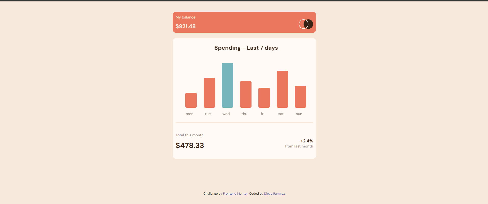

## Welcome! 👋

Thanks for checking out this front-end coding challenge.

[Frontend Mentor](https://www.frontendmentor.io) challenges help you improve your coding skills by building realistic projects.

**To do this challenge, you need a good understanding of HTML and CSS.**

# Frontend Mentor - Expenses chart component solution

This is a solution to the [Expenses chart component challenge on Frontend Mentor](https://www.frontendmentor.io/challenges/expenses-chart-component-e7yJBUdjwt). Frontend Mentor challenges help you improve your coding skills by building realistic projects. 

## Table of contents

- [Overview](#overview)
  - [The challenge](#the-challenge)
  - [Screenshot](#screenshot)
  - [Links](#links)
- [My process](#my-process)
  - [Built with](#built-with)
  - [What I learned](#what-i-learned)
  - [Continued development](#continued-development)
- [Author](#author)

## Overview

### The challenge

Users should be able to:

- View the bar chart and hover over the individual bars to see the correct amounts for each day
- See the current day’s bar highlighted in a different colour to the other bars
- View the optimal layout for the content depending on their device’s screen size
- See hover states for all interactive elements on the page
- **Bonus**: Use the JSON data file provided to dynamically size the bars on the chart

### Screenshot



### Links

- Solution URL: [solution URL](https://github.com/Diego2Drm/expenses-chart-component)
- Live Site URL: [live site URL](https://diego2drm.github.io/expenses-chart-component/)

## My process

### Built with

- Semantic HTML5 markup
- CSS custom properties
- Flexbox
- CSS Grid
-Css Animation
- Mobile-first workflow

### What I learned

```html
<h1>Some HTML code I'm proud of</h1>
```
```css Animation
header img {
  width: 5rem;
  height: 5rem;
  animation: moveY infinite 5s ease-in-out;
}
/* Animations */
@keyframes moveY {
  0%,
  100% {
    transform: translateY(1rem);
  }
  50% {
    transform: translateY(-1rem);
  }
}
```
```js manipulation DOM
const container = document.querySelector(".container");
const newList = document.createElement("ul");

container.appendChild(newList);

items.forEach((item) => {
  const listItems = document.createElement("li");
  const percentage = document.createElement("div");
  const span = document.createElement("span");
  span.classList.add("percentage");

  listItems.textContent = item.day;
  percentage.style.height = item.amount * 3 + "px";
  span.textContent = `$${item.amount}`;

  percentage.appendChild(span)
  listItems.appendChild(percentage);
  newList.appendChild(listItems);
});

```


### Continued development

Manipulation DOM JavaScript

## Author

- Github - [Diego Ramìrez](https://github.com/Diego2Drm)
- Frontend Mentor - [@Diego2Drm](https://www.frontendmentor.io/profile/Diego2Drm)

